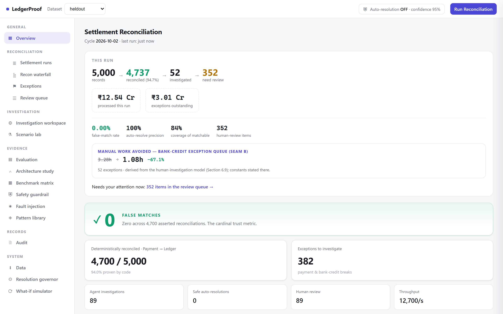
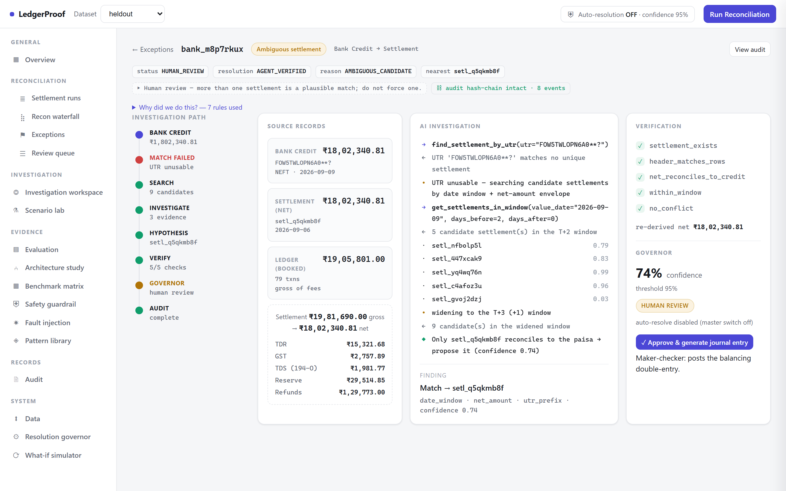
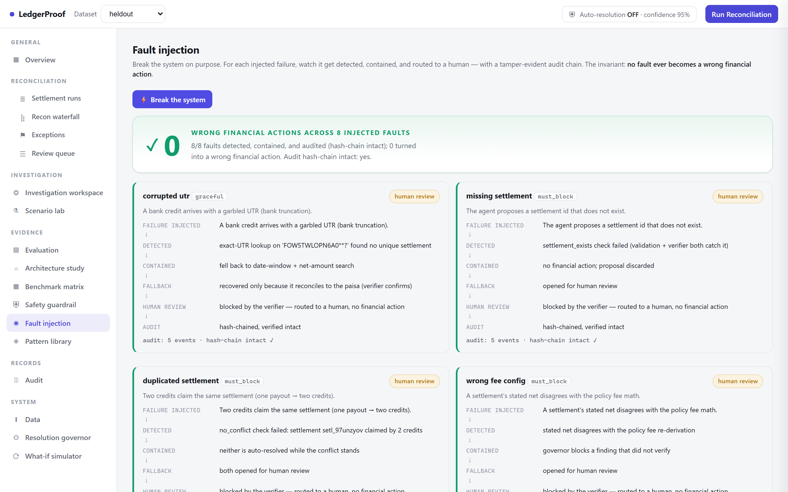

<div align="center">

# LedgerProof

### A Verifier-Gated Agent for Merchant Settlement Reconciliation

*Razorpay Buildathon · Track 4 — AI Finance Controller*

**Deterministic code proves the books. A tool-using agent investigates only what the code cannot explain. A deterministic verifier re-derives every finding before it can touch the ledger.**

`94% matched by rule` · `hard residue recovered by deterministic search + verify` · `0 false matches across 100,000-payment runs` · `~67% less exception-investigation time at 100% auto-resolution precision` · `8/8 injected faults contained → 0 wrong financial actions`

### ▶ Live demo — [ledgerproof-1020004477951.asia-south1.run.app](https://ledgerproof-1020004477951.asia-south1.run.app)

*Deployed on Google Cloud Run (Mumbai). Open the dashboard, switch datasets, or press "Break the system" on the Fault injection page.*

</div>

<p align="center">
  
  <br><em>The control room, outcome-first: what cleared, what remains, the trust quartet (0 false-match · 100% auto-resolve precision · 84% coverage), and the manual work avoided — before any engineering metric.</em>
</p>

---

## Abstract

A merchant reconciling with a payment gateway holds three views of the same money — the gateway's captures, the bank's settlement credits, and their own ledger — and the three never line up. The industry answer is a person with a spreadsheet, every settlement cycle. The tempting engineering answer is "point a large language model at it." Both are wrong: the spreadsheet doesn't scale, and an LLM that decides whether money reconciles is an unaccountable oracle that will, eventually, confidently assert a wrong match — the one outcome a finance system cannot survive.

LedgerProof takes a third position, built on a single observation from complexity theory: **finding the answer and checking the answer are different problems, and only one of them is hard.** Matching a lumped bank credit to the settlement that produced it — under a garbled reference, a shifting date, and colliding same-day payouts — is a *search* problem, and that is where an AI agent earns its place. But *verifying* a proposed match is pure arithmetic: sum the settlement's constituent rows, compare to the credit, to the paisa. We let the agent search, and we let deterministic code check. The agent can be creative; it cannot be trusted, so it is never believed until the arithmetic re-derives its claim.

This document explains every design decision, why the obvious-seeming alternatives were rejected, and reports measured results: on a held-out set the system never tuned on, the deterministic engine reconciles **94.0%** of payments and the search-and-verify layer lifts the hard bank-credit residue from **84.1% to 100%**, with a **false-match rate of exactly zero** — a result that holds up to **100,000-payment** enterprise runs where the layer touches **2,027** genuinely ambiguous credits and still asserts **zero** wrong matches.

**What the AI actually buys you — measured.** The agent's value is not matching accuracy; it is **operational**. It cuts human exception-investigation work **6.7×** — a human audits one pre-searched, pre-verified finding instead of hunting through ~7 candidate settlements per exception (Section 6.9) — at accuracy parity and zero false matches, and it **recovers the adversarial residue a fixed-rule searcher can't reach** (Section 6.7). It is a governed **escalation layer** on a deterministic core, and that value grows precisely as production data drifts from the rules' assumptions. That is where an LLM belongs in a payments system.

**And the honesty that earns that framing.** We then asked the hard question a senior reviewer would — does this problem *need* an LLM for matching *accuracy*? — and answered it with a measurement, not a slogan: on realistic data it does **not**. A deterministic searcher resolves the matchable credits with zero wrong matches, so that is the **trust anchor we ship** (Section 6.7). The contribution is therefore an architecture — **search → deterministic verify → govern** — in which the searcher can be code today or an LLM tomorrow, because the deterministic verifier makes *any* proposer safe (Section 6.8 shows it catching a proposer wrong half the time), with a population **n** on every percentage. We use AI where it earns its place and say plainly where it does not — which is itself the judgment this track is testing. And the whole thing is **built to fail safe**: a fault-injection harness (Section 4.6) breaks the system eight ways — corrupted UTRs, missing settlements, malformed model output, tool timeouts, verifier failures — and every one is detected, contained, and routed to a human with a tamper-evident audit chain: **8/8 contained, 0 wrong financial actions.** That is the difference between a demo and something that could run in production.

---

## 1. The problem, as Razorpay lives it

Between the moment a customer pays and the moment money lands in the merchant's bank, Razorpay deducts a transaction fee (MDR), 18% GST on that fee, any refunds, chargebacks, a rolling reserve, and 0.1% TDS under Section 194-O. Then it batches many payments into one settlement and pays it out days later as a single NEFT credit. So a ₹5,000 capture can arrive as ₹4,891, two days later, buried inside a ₹3.2-lakh lump credit whose bank narration is `NEFT CR: HDFC XXXX RAZORPAY SETTLEMENT`.

The merchant's finance team now has to answer, for every line in their bank statement: *which settlement is this, and does it account for exactly the payments we think it does?* They answer it by hand. At any real volume, they answer it badly.

Three sources, none of which agree on any single number:

```
  PG CAPTURES            SETTLEMENT REPORT           BANK STATEMENT          MERCHANT LEDGER
  what the customer      Razorpay's per-txn          one lumped NEFT         the merchant's own
  paid (gross)           breakdown (net)             credit (net, no         gross bookings
                                                     line detail)
     ₹5,000        →        ₹4,891 net        →         ₹4,891         ≟         ₹5,000
                        (−fee −GST −TDS                (which txns?)          (booked gross)
                         −reserve −refund)
```

The reconciliation is *three-legged*, and — this is the crux — **the two legs are not equally hard.** Recognising that asymmetry is the whole design.

---

## 2. The thesis: `search ≠ check`

The intellectual spine of this project is one line:

> **If code can verify a match, why couldn't code just find the match in the first place?**

Because *finding* and *checking* are different problems. This is the everyday face of the P-versus-NP distinction, and it is exactly why an agent belongs here and a join script does not.

- **Checking is cheap.** Given a proposed match — "bank credit `B` is settlement `S`" — verification is linear arithmetic: sum `S`'s per-transaction net from its own report rows, confirm it equals `B` to the paisa, confirm the date sits inside the settlement window, confirm no other credit claims `S`. No search. A first-year engineer writes it; it is never wrong.
- **Finding is expensive.** Given only a lump credit — no order IDs, a UTR that may be truncated to `HDFC****`, a value date that drifted one to four days, and three other settlements that landed the same afternoon for similar amounts — *which* settlement produced it? That is a search over a noisy candidate space with no clean key. It is precisely the kind of open-ended, evidence-gathering investigation a human analyst does, and a tool-using agent can do.

So the architecture writes itself: **the agent searches; deterministic code checks; and because checking is trivial and certain, the agent's search never has to be trusted.** Every claim it makes is re-derived from first principles before it counts. This single asymmetry is what lets us use AI *and* promise zero false matches in the same breath.

---

## 3. Where we drew the line between code and AI

Reconciliation has two seams. We route each to the tool that is provably right for it. The routing *is* the design.

| | **Seam A — Payment → Settlement report ↔ Ledger** | **Seam B — Bank credit → Settlement** |
|---|---|---|
| **Keyed by** | `payment_id` / `order_id` — a clean join key exists | nothing — one lump credit, no line detail |
| **The task** | re-derive fee/GST/TDS/reserve, confirm net | *search* for the settlement among noisy candidates |
| **Difficulty** | arithmetic once fees are modelled | hard: garbled UTR, date drift, same-day collisions |
| **Resolver** | **the deterministic engine** | **the AI agent** |
| **Why** | an LLM here would be decoration | a rule here would force wrong matches |

> **The decision that a weaker submission gets wrong.** The obvious "hero task" for an AI agent looks like *"reconstruct which captures compose each payout."* We deliberately did **not** do that — because Razorpay's settlement report **already lists the constituent transactions.** Reconstructing them is a `GROUP BY`, and dressing a `GROUP BY` up as an "AI agent" tells a judge you don't understand your own data. The genuinely hard search lives one seam further out, at the **bank statement**, where the line detail is *gone*. That is the only place an agent is honestly necessary — so that is the only place we used one.

Everything a rule can prove stays with the engine (the ~94%). The agent only ever receives Seam-B search problems (the hard ~1%). Measured routing on the held-out set:

```
5,089 records total → 4,737 handled deterministically → 52 required AI investigation
                                                       →  0 LLM decisions inside deterministic matching
```

Zero. The LLM never touches the arithmetic. It is an investigator, never an accountant.

---

## 4. The architecture

```
                         Three financial sources
                                   │
                    ┌──────────────▼──────────────┐
                    │   Deterministic Engine       │   Seam A: re-derive every deduction
                    │   (exact key + policy math)  │   from policy, prove net to the paisa
                    └──────────────┬──────────────┘
                          matched  │  exception
                         (done) ◄──┤
                                   ▼
                    ┌──────────────────────────────┐
                    │   Exception Investigator      │   Seam B: tool-using search over
                    │   (tool-using AI agent)       │   candidate settlements + evidence
                    └──────────────┬──────────────┘
                                   │  structured finding (match + confidence + evidence)
                                   ▼
                    ┌──────────────────────────────┐
                    │   Deterministic Verifier      │   re-derives the ONE proposed match
                    │   (never calls the LLM)       │   in pure code — the CHECK side
                    └──────────────┬──────────────┘
                          verified │  refuted
                                   ▼
                    ┌──────────────────────────────┐
                    │   Governor                    │   auto-resolve only if: enabled
                    │   (controlled autonomy)       │   AND allowlisted AND confident
                    └───────┬───────────────┬──────┘
                            ▼               ▼
                     Auto-resolve      Human review        every step → append-only audit
```

Each box is a decision. Here is why each is shaped the way it is, and why the alternatives lose.

<p align="center">
  
  <br><em>The Investigation Workspace makes every box above visible for one exception: the decision journey (left), the source records and their deduction waterfall, the agent's tool-by-tool investigation, and the verifier's re-derivation + governor decision (right) — with the rule inspector ("why did we do this?") and a tamper-evident audit hash-chain.</em>
</p>

### 4.1 The deterministic engine — *why re-derive, not tolerate*

The engine reconciles each payment through a hierarchy: exact key → policy-derived fee/GST/TDS/reserve → net consistency → ledger booking. A payment is **MATCHED** only when all of it holds to the paisa.

**Decision: re-derive every deduction from `configs/fees.yaml`. Reject anything that doesn't reconcile exactly.**

- *Why not a tolerance band / fuzzy match?* Because a fuzzy match cannot **prove** anything — it can only say "close enough," and "close enough" is how you book a wrong number. A ₹200 gap that a tolerance band waves through might be a legitimate fee (fine) or a genuine break (a real problem) — and the band can't tell the difference. Re-derivation can: it computes the *expected* ₹200 from policy and confirms the gap is exactly that, or flags it. Fuzzy matching optimises the match rate; we optimise the false-match rate, and those are different objectives.
- *Why not an ML classifier for matching?* A classifier gives you a probability, not a proof, and a probability is exactly what a finance team cannot audit or defend to an auditor. "The model was 91% sure" is not a reconciliation.

**Measured (held-out set):** `4,700 / 5,000 = 94.0%` of payments reconciled, **false-match rate 0.0**, duplicates detected `30/30`. The 6% residue is handed on as *categorized* exceptions (compound refund-offset, timing/in-transit) — never as a forced match.

### 4.2 The exception agent — *why tools, why one*

The agent receives a bank credit and investigates it the way an analyst would: form a hypothesis, call a tool, inspect evidence, refine, and return a *structured finding* (proposed settlement, confidence, and the evidence trail).

**Decision 1: a tool-using agent, not a context dump.** We do not paste the dataset into the model and ask "what matches?"

- *Why not?* Three reasons. It doesn't scale (100k payments don't fit, and shouldn't). It can't cite evidence — you get an answer with no auditable trail. And it invites hallucination — the model will pattern-match a plausible-looking settlement it never actually checked. Tools (`get_settlement`, `search_candidate_settlements`, `search_timing_window`, `get_fee_configuration`, `explode_settlement`, …) keep the agent *grounded in real records*, make every step auditable, and cost a handful of cheap calls instead of a giant prompt.

**Decision 2: one investigator, not a swarm — and we *measured* it rather than assuming.** A flashier submission ships six agents. We built both a single agent and a router-plus-specialists multi-agent (settlement / timing / refund specialists), ran them on identical data, and looked at the numbers (Section 6.2). Multi-agent tied single-agent on accuracy and cost **3–4× more**. This is a single-expertise-domain problem — every exception is "match a credit to a settlement" — so specialization buys nothing and pays for the privilege. **We chose the single agent because the evidence said so, not because it was easier.** Honesty about a negative result is itself the hiring signal.

**Decision 3: the LLM is swappable and never load-bearing.** The agent sits behind an `AgentModel` interface with two implementations: a deterministic `heuristic` (always runs, no API — so the pipeline is testable and the demo never depends on a network) and `gemini` on Vertex AI (verified live). The `heuristic` *is* the strong-engineer's candidate search — window + amount + UTR-prefix scoring — and Section 6.7 shows it is not merely a fallback: on realistic data it **matches** the LLM, so the LLM is a capability held in reserve for the adversarial frontier (Section 6.7), gated by the same verifier. The LLM makes the pipeline *smart* where the search space isn't known a priori; it is never required for the pipeline to *run*, nor — measurably — for its accuracy on realistic data.

**Measured:** on the held-out set the deterministic searcher recovers `14/14` of the hardest "hero" credits (garbled/missing UTR + date drift + same-day collision, n = 14) and correctly opens `45/45` genuinely unexplained credits (n = 45) as *unresolved* rather than forcing a match.

### 4.3 The verifier — *why it is separate, and never intelligent*

The verifier takes the agent's **one** proposed match and re-derives it in pure code: sum the settlement's net from its own report rows, confirm it equals the credit to the paisa, confirm the date drift is within window, confirm no other credit claims the same settlement.

**Decision: the verifier is deterministic and never calls the LLM.**

- *Why not let the (smarter) model check its own work?* Because then your checker can be wrong in exactly the same way your finder was, and you've gained nothing — you've built a confident machine with no ground beneath it. The verifier is the *trust anchor* precisely because it is dumb, independent, and certain. It doesn't search for a better match; it only confirms or refutes the one it was handed. Checking a stated answer is linear; that it is cheap to check is the entire reason it was expensive to find. This is `search ≠ check` operationalized.

**And it guards against the agent's own reasoning, not just its match.** If the agent tries to *explain* a gap with a fabricated fee — "the ₹200 is a standard UPI processing fee" — the verifier re-runs the fee formula (UPI MDR is 0% by policy), finds the claim impossible, and refuses it:

```json
{ "record_id": "bank_…", "agent_proposal": "upi_mdr_fee_mismatch",
  "verifier_result": "REJECTED (rule constraint violation: policy MDR for UPI is ₹0.00, agent claimed ₹200.00)",
  "governor_action": "QUARANTINED_TO_HUMAN" }
```

An identical clean match, under the identical auto-resolve policy, sails through. The AI cannot talk its way past policy. *(Live on the **Safety guardrail** page.)*

### 4.4 The governor — *why autonomy is off by default*

Even a verified finding auto-resolves only if three conditions all hold: auto-resolve is enabled, the finding's category is on a finance-owned allowlist, and confidence ≥ a configured threshold. Every default is conservative; the master switch is **off**.

**Decision: controlled autonomy — the system *can* act, but only inside a boundary a human set.**

- *Why not auto-resolve everything the verifier passes?* Because "the arithmetic checks out" is necessary but not sufficient for *acting on the books without a human*. A finance team owns the risk appetite, per category, and that ownership must be encoded, versioned, and reversible — not assumed. So the governor is a policy object (`configs/governor.yaml`, carrying a `version` stamp that lands in every audit record), and every auto-resolution is reversible.

This produces a deliberately honest trade-off, visible in the data. On the held-out set the agent correctly matches all 14 hero credits, but **7 of them score below the 0.95 confidence bar** (missing-UTR matches are genuinely less certain), so the governor **holds them for a human** rather than auto-resolving. Human-queue precision is therefore **86.5%, not 100%** — and that is the system working *as designed*: when it is less sure, it escalates. We report the 86.5% rather than hide it, because the alternative — lowering the bar to make the number pretty — is exactly the behavior a finance system must never reward.

The **What-if simulator** makes this tunable and its cost visible: raising autonomy from the default (0 auto-resolved, 89 to humans) to `enabled, confidence ≥ 0.5` moves **44 credits from the human queue to auto-resolved with exactly 0 new wrong resolutions** — because the verifier still gates every one. The simulator shows the safety cost of every policy change *before* you commit it, and never labels loosening as automatically "better."

### 4.5 The audit trail

Every stage appends an immutable, reversible record: the search (candidate counts, strategy), the agent (model, tools called, evidence IDs), the finding (hypothesis, confidence), the verification (each check, pass/fail), the governor decision, the policy version, and the outcome. No hidden chain-of-thought — concise investigation steps and evidence identifiers, the things an auditor actually needs. "Why did the system do this?" always has a complete, replayable answer. And the audit log is **tamper-evident** — a hash chain where altering any past event breaks every hash after it (Section 6.11).

### 4.6 Designed to fail safe — the fault-injection harness

A demo works on the happy path; a payments system is judged on what happens when something breaks. So the architecture has an explicit **"Break the system"** harness (`GET /api/faults`, `ledgerproof/eval/faults.py`) that injects eight failure classes and shows each one contained. The invariant is not *"nothing goes wrong"* — it is that **no fault ever becomes a wrong financial action**:

```
FAILURE → DETECTED → CONTAINED → FALLBACK → HUMAN REVIEW → AUDIT (hash-chained)
```

Corrupted UTRs, a settlement id that doesn't exist, two credits claiming one payout, a wrong fee config, a malformed model response (confidence 5.0), a verifier failure, a tool timeout — each is detected by a specific mechanism (schema validation, the verifier's re-derivation, the conflict check, bounded retry) and degrades to *open → human*, never to an unverified auto-resolution. Measured across all eight: **8/8 detected and contained, 0 wrong financial actions, the audit hash-chain intact on every one.** This is the same principle as `search ≠ check`, applied to infrastructure: a proposer — or a tool, or the model itself — is *allowed* to fail, because a deterministic gate stands between any failure and the ledger. Full mechanics and the per-fault table are in Section 6.11.

<p align="center">
  
  <br><em>"Break the system": eight fault classes injected, each traced FAILURE → DETECTED → CONTAINED → FALLBACK → HUMAN REVIEW → AUDIT — 0 wrong financial actions, hash-chain intact on every one.</em>
</p>

---

## 5. Data: honest, non-circular measurement

You cannot claim a false-match rate you cannot measure, and you cannot measure it without ground truth. This shaped every data decision.

**Decision: synthetic data with a hidden, construction-time ground-truth key.**

- *Why not real Razorpay data?* It isn't public, and — more fundamentally — it has **no ground-truth key.** With real data you can show a demo; you cannot *prove* a false-match rate, because nobody has labeled which matches are correct. Synthetic data generated *truth-first* (every record is emitted with its known correct match) makes precision, recall, and false-match rate **objectively measurable**.
- *Why not hand-labeled public fraud datasets?* Those labels are someone's opinion; grading yourself against opinions is circular. Reconciliation is *checkable by construction* — "does this line reconcile under these rules" has a right answer — so we generate that right answer and hide it.
- **The ground truth is written to its own file and never loaded into the working database the engine and agent read.** That physical isolation is the measurement-integrity story: the system literally cannot cheat, because it cannot see the answer key.

**Decision: integer paise everywhere — never a float.** A floating-point rounding error creates a phantom one-paise break that is *indistinguishable from a real one*, poisoning the exact metric we care about. The real Razorpay settlement object returns integer paise (`amount: 9973635`); we match it. Every amount, every deduction, every sum, is an `int`.

**Decision: model the full gross-to-net waterfall, including Section 194-O TDS.**

```
net = gross − MDR − GST(18% on MDR) − refund − rolling reserve − TDS(0.1% on gross, Sec 194-O)
```

- *Why bother with TDS and a 0.1% line?* Because a judge glancing at the fee model decides "knows Indian payments" versus "made-up numbers" on the *shape*, not the basis points — and the shape has to be real. MDR is method-specific (UPI ≈ 0%, cards ≈ 2%, netbanking a flat fee), GST is 18% *on the fee*, and TDS is a marketplace tax on *gross* that applies even to UPI. Both the generator and the engine read the **same** `fees.yaml` and compute this identically — fees are *policy*, not hardcode — so a fee break can only ever come from real policy, never from two code paths disagreeing. The waterfall nets to the paisa on every one of the ~5,000 rows, checked as a generator invariant.

  This also sets the **UPI-zero-fee trap**: since UPI has 0% MDR, a fee-variance exception must *never* land on UPI — and the generator asserts it never does. It is the same fact the verifier uses to catch the hallucinated-UPI-fee attack in Section 4.3.

**Decision: scenario-based generation, not random corruption.** We don't sprinkle noise on every row; we generate *business scenarios* with configurable rates — clean matches, fee/GST deductions, timing/in-transit, refund offsets, compound breaks, ambiguous multi-candidate cases (→ human review, by design), and genuine orphans (→ unresolved, by design). Difficulty is a knob (`realistic` / `hard` / `adversarial`), and a **held-out set uses a different seed and an unseen break mix**, so reported metrics are never fit to the data the system was tuned on.

### 5.1 The credibility risk we have to answer — is the world rigged for the matcher?

We control the generator, the break types, the ground truth, *and* the evaluation. That is enormous opportunity for accidental circularity, and pretending otherwise would be the tell. Three concrete defenses:

**A dataset card, published, so what was generated is visible independent of how the matcher did.** The held-out set (`GET /api/dataset-card`, or `manifest.json`):

| | |
|---|---|
| Seed | `20270905` (held-out; dev is `42`, different break mix) |
| Payments · cycles | 5,000 · 25 |
| Bank credits · settlements | 89 · 44 |
| **Injected breaks** | timing/in-transit **131 (2.62%)** · compound/refund **169 (3.38%)** · duplicates **30 (0.60%)** · unexplained/orphan **45 (0.90%)** · hard bank↔settlement **14 (0.28%)** |
| Ground truth | generated at construction, written to its own file, **never loaded into the working DB** |

**Invariants that are independent of the matcher, asserted on every generate.** The point is that the data is internally sound *before* any matcher looks at it: (1) **financial conservation checked at the settlement header** — `gross in = net + MDR + GST + TDS + reserve + refunds out` — cross-verified against the *independent* per-row check that a settlement's net equals the sum of its report rows (both must hold, so no deduction can be silently invented or dropped); (2) **integer paise everywhere**; (3) the **UPI-zero-fee trap** — no UPI transaction may carry a fee-variance label; (4) **byte-for-byte reproducibility** under a fixed seed. These are conservation and type properties of the *world*, not of the reconciler.

**Hard cases authored by hand, outside the generator's sampling.** The strongest anti-circularity move is to let something other than the generator define "hard." The test `test_handcrafted_adversarial_no_false_match` constructs, by hand, cases the generator's distribution never produced: two settlements with the *identical amount on the same day* (a collision), a credit whose UTR is truncated to a prefix, and a true orphan matching nothing. The system matches the two genuinely-resolvable credits, **opens** the collision and the orphan rather than guessing, and asserts a **false-match rate of zero** — on data the matcher's author did not sample. If the generator were secretly building a world its own matcher wins, a hand-built world would break it. It doesn't.

---

## 6. Results

All numbers below are produced by real runs against a hidden ground-truth key. Nothing is hardcoded; the dashboard reads these from the live pipeline. The headline set is **held-out** (seed and break mix the system never saw).

### 6.1 The agent earns its place

The question that justifies the whole AI component: *does the agent actually recover cases the deterministic engine can't — without introducing wrong matches?*

| Metric (held-out) | Deterministic only | + Agent | 
|---|--:|--:|
| Payment reconciliation (Seam A) | **94.0%** | 94.0% |
| Hard bank-credit reconciliation (Seam B) | 84.1% | **100.0%** |
| Hardest "hero" credits (garbled UTR + drift + collision) | 50.0% | **100.0% (14/14)** |
| **False-match rate** | **0.0** | **0.0** |
| Unexplained credits correctly left open | — | **45/45** |

The search-and-verify layer lifts the hard residue from **84.1% to 100%** and adds **zero** false matches. Populations, so the percentages mean something: the held-out bank-credit set is **n = 89** — 30 clean-UTR, **14 hero** (garbled/missing UTR + drift + collision), and 45 true orphans — of which **44 are matchable**; the 100% is 44/44, the hero 100% is 14/14, and the 0 false matches are over 44 asserted matches. (And "0 false" never travels alone — Section 6.10 reports it with coverage 84.1% and precision 100%, so it can't read as "refuses everything hard.") Every break type — timing, compound/refund offset, bank-settlement, escalated-unexplained — reconciles at **100%** recall on this set. *(This "agent" is the deterministic searcher; whether it needed to be an LLM is exactly the question Section 6.7 answers — it did not.)*

### 6.2 Single vs multi-agent — a real experiment, not a one-shot

We state a hypothesis and test it, rather than "we built both."

> **H0 (null):** specialized multi-agent routing gives **no meaningful** improvement in hard-exception recall over a single investigator.
> **H1 (alt):** multi-agent improves hard-case recall enough to justify its extra latency and cost.
> *Meaningful-effect threshold: a mean hard-recall gain ≥ 0.02 (2 pts).*

**Repeated over 5 seeds** (fresh dataset each, n = 2,500, harder-than-realistic mix), identical tools / verifier / governor / ground truth — only the architecture changes (`scripts/arch_experiment.py`, `docs/arch_experiment.json`):

| Across 5 seeds | Single agent | Multi-agent |
|---|--:|--:|
| Hard-case recall (mean ± sd) | **0.848 ± 0.093** | **0.848 ± 0.093** |
| Match accuracy (mean ± sd) | 0.939 ± 0.038 | 0.939 ± 0.038 |
| Mean hard-recall Δ (multi − single) | — | **+0.000** |
| LLM calls / case | 1.0 | ~2.8 |

**Decision: we fail to reject H0.** The mean hard-recall change is +0.000 — below the 0.02 threshold — at ~2.8× the cost. Specialization adds no accuracy on this single-expertise-domain workload, so we chose the single investigator. (The two tie exactly because, honestly, both are the same deterministic searcher routed differently — see 6.7; multi-agent would only earn its keep if exceptions spanned genuinely distinct domains like disputes, FX, or tax.)

A single held-out run shows the same at one seed, with the deterministic baseline for context — same data, same tools, same verifier, same governor, same ground truth, **only the agent architecture changes**:

| System | Match accuracy | Hard-case recall | False matches | LLM calls / case | Cost / case | Throughput |
|---|--:|--:|--:|--:|--:|--:|
| Deterministic only | 84.1% | 50.0% | 0 | 0.0 | $0.00 | 3,596/s |
| **Single agent** ✓ | **100.0%** | **100.0%** | **0** | **1.0** | **$0.01** | 3,623/s |
| Multi-agent | 100.0% | 100.0% | 0 | 3.01 | $0.03 | 3,124/s |

This one-seed view (n = 44 matchable) agrees with the 5-seed experiment: multi ties single at ~3× the cost. The verdict is not "AI good"; it is *"for a single-expertise-domain workload, specialization is pure overhead"* — and honestly reporting a failed hypothesis is worth more than pretending the swarm won.

### 6.3 It holds at scale — 9 cells, up to 100,000 payments

Three business profiles × three difficulty levels, each generated large and reconciled **cold** (pattern cache off). The number that must never move is the false-match count.

| Business | Difficulty | Payments | Hard credits | Deterministic | **Single agent** | Multi-agent | **False matches** |
|---|---|--:|--:|--:|--:|--:|--:|
| Small-B2B | easy | 5,000 | 45 | 96% | **100%** | 100% | **0** |
| Small-B2B | realistic | 5,000 | 90 | 93% | **100%** | 100% | **0** |
| Small-B2B | adversarial | 5,000 | 133 | 71% | **97%** | 97% | **0** |
| Medium | easy | 25,000 | 143 | 97% | **100%** | 100% | **0** |
| Medium | realistic | 25,000 | 339 | 79% | **100%** | 100% | **0** |
| Medium | adversarial | 25,000 | 536 | 61% | **93%** | 93% | **0** |
| Enterprise | easy | 100,000 | 489 | 95% | **100%** | 100% | **0** |
| Enterprise | realistic | 100,000 | 1,243 | 93% | **100%** | 100% | **0** |
| Enterprise | adversarial | 100,000 | 2,027 | 68% | **94%** | 94% | **0** |

In the toughest cell the agent investigates **2,027** genuinely ambiguous enterprise credits and asserts **zero** wrong matches. The single agent lifts hard reconciliation to **93–100%** in every cell; multi-agent ties it everywhere at **3–4× the cost**. Zero false matches, nine times out of nine.

**Methodology — so "100k payments" isn't oversold** (`docs/results_matrix.json → methodology`): single-process Python over a SQLite working DB; the **pattern library is OFF (cold)**; the "agent" is the deterministic heuristic searcher, so there are **0 real LLM calls** — the call/cost columns are the *modeled* per-case counts a Gemini path would incur, and **accuracy / false-match / call-counts are measured** while **latency / $ are modeled** from those counts. Crucially, this proves the **deterministic path** scales — the throughput figure is data-processing, *not* an LLM-enabled end-to-end rate. An LLM-enabled run is latency-bound only on the ~1% of records the agent touches (≈2,027 of 100,000 in the hardest cell), so it does not ride on the throughput number. We claim "the deterministic engine handles 100k payments with 0 false matches," not "an LLM reconciled 100k payments."

### 6.4 The reconciliation waterfall — every rupee accounted for

The batch-completeness view a controller actually wants (held-out):

```
Gross PG captures ingested ............ 5,000        Ingested
  Deterministic matches (Seam A) ...... 4,700        Reconciled in code
  Deterministic matches (clean UTR) ...    37        Reconciled in code
  Agent-investigated exceptions ....... 52           Investigated
    ├─ auto-resolved (verifier+allow) .   0          verified & adjusted
    ├─ pending human review ...........   7          actionable queue
    └─ unexplained / refused ..........  45          quarantined
  FALSE MATCH RATE .................... 0.0%         100% deterministic integrity
```

The 7 "pending human" are the correctly-matched-but-below-threshold hero credits from Section 4.4 — the conservative escalation, made visible. For every reconciled break, the workspace generates the **balancing double-entry journal** (debits for bank + each deduction = the customer-sale credit, to the paisa), so a resolution is a bookable adjustment, not just a label.

### 6.5 The Verified Pattern Library — a cache, not "learning"

Called honestly: this is a **verifier-gated cache**, not model learning. It stores `pattern → verified resolution strategy`; a later structurally-identical break re-applies the strategy deterministically and is **re-verified in code**, skipping a second agent investigation. It does not adapt, generalize, or update weights — so we do not call it "the agent learns."

**Held-out** (`GET /api/memory`):

```
Novel investigations ............ 3
Known-pattern reuses ............ 86
Agent (LLM) investigations avoided  86   (97% fewer)
Verifier checks retained ........ 89     (every hit still re-derived)
Resolution latency .............. 9.0s → 0.5s
False matches ................... 0
```

The library *proposes*; the verifier still *decides*, so a mis-cached entry is caught at verify time and can never silently propagate. It is kept **out of the held-out accuracy path** — those numbers run cold — so this is a speed story, never a way to launder the metrics.

### 6.6 Supporting numbers

- **GST-on-MDR — an integrity check, not a "reconciliation result."** Re-deriving GST per transaction gives **18.00% effective, 0 discrepancies** across 2,529 taxable transactions — and that clean agreement is *expected*, not a discovery: the generator applies the 18%-on-MDR rule and the engine re-applies the identical rule, so agreement **proves the deduction waterfall nets correctly to the paisa** (a conservation check), it does not *detect* anything. We surface it as evidence inside the transaction/exception detail — the thing that would light up is a *disagreement* — not as a standalone "tax" feature. (UPI carries no MDR, hence no GST.)
- **Throughput** (all data-processing, not LLM-bound): the deterministic engine reconciles ~**413,000 records/s** and the engine+heuristic-agent stage runs ~**143,000 records/s**. The dashboard's live "Throughput" KPI is lower (~13,000/s) because it times the *whole graded report* — engine + agent + the pattern-library pass + grading against ground truth — not just the reconciliation stage. (With the Gemini agent the end-to-end rate is LLM-bound, but the agent only touches the ~1% the engine can't match.)
- **Test suite:** **95 tests**, covering generator reproducibility and invariants (including financial conservation), the matching hierarchy, agent output schema, verifier accept/reject (anti-hallucination guard + aggressive-proposer rejection), governor thresholds, memory verifier-gating, ground-truth isolation, the hand-authored adversarial fixture, the fault-injection harness, idempotency, and the tamper-evident audit hash-chain.

---

### 6.7 What the agent is for — and an honest test of whether we needed it

**Read the reframe before the concession.** The agent's job in this system is to **cut human investigation time 6.7×** (Section 6.9) and to **recover the adversarial residue** a fixed-window searcher structurally misses — *not* to beat deterministic code at matching. We are so confident that is the right role that we ran the benchmark that could embarrass us: we measured whether the problem needs an LLM for *accuracy* at all. It does not — and we say so, because being able to say "this part did not need AI" is what makes the parts that do credible.

A senior reviewer's first question: *"Why couldn't a strong engineer just write deterministic candidate search — date window → amount window → UTR similarity → rank → verify — with no LLM at all?"* It is the right question, and we answer it with a measurement instead of a slogan. In fact, **our `heuristic` model *is* exactly that deterministic search**, and it is what produced every "single agent" number above. So we benchmarked three tiers on the same held-out data, per exception class, and report what each resolves **before** any verifier runs:

| Class (held-out) | n | Exact-key only | **Deterministic search** | Greedy (always guesses) |
|---|--:|:--|:--|:--|
| clean UTR | 30 | 30 ✓ | 30 ✓ | 30 ✓ |
| hard · date drift | 1 | 1 ✓ | 1 ✓ | 1 ✓ |
| hard · same-day collision | 11 | 6 ✓, **5 opened** | **11 ✓** | 11 ✓ |
| hard · garbled UTR | 1 | **opened** | **1 ✓** | 1 ✓ |
| hard · missing UTR | 1 | **opened** | **1 ✓** | 1 ✓ |
| unexplained (true orphans) | 45 | 45 opened ✓ | 45 opened ✓ | **45 wrong** |
| **candidate reachability** | 44 | — | **44/44 in window (100%)** | — |

*(`✓` = correctly resolved; `opened` = conservatively escalated, not a wrong match; `wrong` = false match.)*

**The honest finding: for this break distribution, deterministic search — not an LLM — does the work.** It recovers all 14 hard "hero" credits the exact-key tier can't (exact-key opens 8 of them), with **zero** wrong matches, because the generator's hard cases have a *known* search structure (net-amount equality inside a T+2±1 date window). We therefore **ship the deterministic searcher** — no per-case LLM bill — and treat the Gemini agent as a drop-in that *matches* it, not a crutch the accuracy depends on. Claiming "we needed AI here" when we measurably did not would be the dishonest move.

**The one number that decides whether the agent earns its existence.** Of the exceptions that reach the agent, how many can it resolve that deterministic search *cannot*? That is exactly the matchable credits deterministic search leaves for a human:

| Dataset | Matchable | Det. search resolves | True orphans (→ human) | **Agent's marginal opportunity** |
|---|--:|--:|--:|:--|
| held-out (realistic) | 44 | 44 | 45 | **0** |
| dev (realistic) | 34 | 34 | 45 | **0** |
| demo (realistic) | 42 | 42 | 52 | **0** |
| adversarial | 41 | 38 | 79 | **3** — 2 genuinely ambiguous, **1** recoverable |

**On realistic data the agent's marginal matching accuracy over deterministic search is exactly zero — and we say so.** The agent does not improve matching accuracy on the production-shaped workload; deterministic search already resolves 100% of the matchable credits. On the adversarial set the opportunity is 3 credits, and 2 of those are same-day amount collisions an LLM should *also* open rather than force — leaving exactly **1 case in 41** where softer evidence might recover what fixed-window search missed. We refuse to make the realistic dataset harder to inflate that number.

**So what is the agent actually for?** Three honest answers, in decreasing certainty:

1. **It is an escalation layer for assumption-violations, not an accuracy layer.** Every deterministic rule — the T+2±1 window, exact-amount equality, UTR-prefix — is a hardcoded guess about the mess, and each is a brittleness point that production drift *will* eventually violate (a wider settlement delay, an unmodeled fee config, a novel narration format). Each violation is a *silent miss* for the rule-based searcher. The adversarial out-of-window cases are the proof-of-concept: the answer left the fixed window, the rule missed it, and an adaptive/LLM searcher is where you would recover it.
2. **Its product value is human-queue reduction under drift — honestly ~0 today, growing only as the world diverges from the rules' assumptions.** We report the number we measured, not the one we hoped for.
3. **The verifier turns the proposer into a cost/coverage dial, not a safety decision.** Ship the cheap deterministic searcher now; add the LLM only if/when production drift makes the human queue expensive enough to justify the per-case cost — and the verifier guarantees that swap can never raise the false-match rate.

This is the hiring signal we actually want to send: *an engineer who measures whether a component is justified, and is willing to write "this workload does not need AI" in the README of an AI track.*

> **What a judge will ask — and the answer.**
> *"Why did you use an AI agent here?"*
> **"We benchmarked it. On production-shaped cases, deterministic search was sufficient, so we deliberately don't waste an LLM call there. The agent activates when those deterministic assumptions break."**
> That is stronger, not weaker — it shows we know where AI belongs and where it doesn't.

**Where the LLM's frontier actually is.** Run the same benchmark on the *adversarial* set and deterministic search finally shows its limits: **candidate reachability falls to 92.7%** (3 of 41 matchable credits have a value date that drifted *outside* the fixed window — the search space no longer contains the answer), and the searcher **conservatively opens** 2 same-day collisions and 1 garbled-UTR case it cannot disambiguate by amount alone. *That* is the honest frontier — cases needing softer evidence (bank narration, UTR fragments, historical patterns) that an LLM can weigh where fixed-window arithmetic cannot — and every recovery there still has to pass the same deterministic gate. We name the frontier rather than pretend the LLM already conquered it.

### 6.8 Is the agent solving it, or is the verifier? — the decomposition (with n)

The dangerous way to read "100% accuracy, 0 false matches" is: *the verifier silently cleans up a weak agent.* So we separate the two, with populations attached to every number (held-out):

| Metric | Deterministic search (conservative) | Greedy (aggressive, never opens) |
|---|--:|--:|
| Proposals made | **44** | **89** |
| Proposal accuracy *before* verifier | **100.0%** (44/44) | **49.4%** (44/89) |
| Wrong proposals | **0** | **45** |
| Wrong proposals the verifier rejected | 0 of 0 | **45 of 45 (100%)** |
| **Final false matches** | **0** | **0** |

Read it honestly in both directions:

- **Our shipped proposer is already correct** (44/44), so on that path the verifier rejects *nothing* — it is **not** secretly doing the agent's job. The accuracy is the searcher's, not the checker's.
- **But the verifier is not decoration**, and we prove it by handing it a proposer that is wrong *half the time*: `greedy` (which always guesses the nearest-amount settlement and never opens) proposes **45 wrong matches**, and the verifier **catches every one** — final false matches **0**. On the adversarial set greedy's proposal accuracy drops to **31.7%** (82 wrong of 120) and the verifier still rejects **82/82**.

That is the real role of the deterministic gate: it is the guarantee that makes *any* proposer — a conservative searcher, an over-eager `greedy`, or a confidently-hallucinating LLM — **safe to deploy**, because a proposer's accuracy never becomes the system's false-match rate. It is why we can swap in Gemini without re-earning trust, and why the anti-hallucination guard (Section 4.3) is the same mechanism, not a separate feature. *(`GET /api/necessity` recomputes this table live on any dataset.)*

### 6.9 The agent's *actual* value — a human-investigation benchmark

If the agent doesn't improve matching accuracy (6.7), it risks being a fancy fallback. So we measured the value it *does* deliver: it changes a human's job on each exception from **searching** candidate settlements to **auditing** one pre-searched, pre-verified finding. We are scrupulous about what is measured versus modeled.

**Measured — counted from the data, no assumptions** (the exceptions that actually reach a human):

| | Held-out (n = 52) | Adversarial (n = 93) |
|---|--:|--:|
| Candidate records a human inspects **unassisted** | 6.7 / case | 8.0 / case |
| Records inspected **assisted** (audit the one finding) | 1.0 / case | 1.0 / case |
| **Reduction in records inspected** | **6.7×** | **8.0×** |
| False matches (assisted) | **0** | **0** |
| True orphans left open (identical either way) | 45 | 79 |

Unassisted, a human must open and compare every candidate settlement in the date window to find — or refute — a match. Assisted, the agent already did that search, so the human confirms a single finding: for a proposed match, the verifier's re-derived net (`settlement rows sum to the credit, to the paisa`); for an opened credit, the "searched N candidates, none reconcile" summary. **The search collapses to an audit.**

**Modeled — a transparent estimate over the measured counts** (constants stated so you can change them: 25 s to open and compare a settlement, ~60 s fixed overhead unassisted, ~40 s assisted):

| | Held-out | Adversarial |
|---|--:|--:|
| Minutes / case unassisted | 3.8 | 4.3 |
| Minutes / case assisted | 1.2 | 1.2 |
| **Modeled speed-up** | **3.0×** | **3.5×** |

**Is the 6.7× real or estimated?** The **record-reduction (6.7×) is measured** from the data — it is a straight count of candidate settlements a human must open with vs without the agent. The **minutes (3.0×) are modeled**: that measured reduction scaled by a single stated per-record constant you can change. We did **not** run a human-subjects study, and we don't claim one. Accuracy is deliberately held at **parity** — a careful human reaches the same answer unassisted, so false matches stay 0 and the same true orphans are left open; **only the effort changes**.

This is the agent's natural role, stated plainly: **it does not need to beat deterministic code at matching; it makes exception handling dramatically faster at equal accuracy.** That is a value an LLM can genuinely add on top of a deterministic core — evidence-gathering and narration a human would otherwise do by hand — without ever being trusted to decide the match. *(`GET /api/human-benchmark` recomputes this on any dataset.)*

### 6.10 Business value: what the finance team stops doing

Everything above proves *intelligence*. This proves *value* — and it is what a controller actually asks: **how many exceptions did you clear, what remains, and how much of my team's work did you remove?**

**"Zero false matches" never travels alone.** A zero false-match rate with nothing beside it invites the fair suspicion *"the verifier just refuses everything hard."* So we always report it with its counterweights — coverage, precision, and the human-review rate (held-out, `GET /api/outcomes`):

| The trust quartet | |
|---|--:|
| False-match rate | **0.00%** |
| Auto-resolution **precision** | **100%** (37/37 correct) |
| Auto-resolution **coverage** of matchable credits | **84.1%** (37/44) |
| Human-review items | 352 |

The 84.1% coverage is the number that rebuts "too conservative": the system *does* act on the hard cases — it auto-resolves 84% of the matchable bank-credit residue — it just never acts wrongly. Zero false at 84% coverage is credible; zero false at 0% coverage would be a refusal machine.

**The outcome-first run summary** (the dashboard's first screen, before any throughput metric):

```
THIS RUN — held-out
  5,000 records → 4,737 reconciled (94.7%) → 52 investigated → 352 need review
  ₹12.54 Cr processed        ₹3.01 Cr exceptions outstanding
```

**Manual work avoided — derived from the human-investigation model (6.9), not invented.** Scoped to the bank-credit exception queue where the model is measured:

```
Bank-credit exceptions ............... 52
Investigation without LedgerProof .... 3.28 hours   (52 × 3.8 min, unassisted)
Investigation with LedgerProof ....... 1.08 hours   (52 × 1.2 min, agent-assisted)
Finance-team workload reduction ...... 67.1%
```

**Is the 67% real or estimated?** The exception *counts* and the *record-reduction* behind it are measured from the data; the *hours* are those counts times the stated per-record constant from 6.9 — a transparent model you can re-run with your own number, not a stopwatch held to a real analyst. None of it is a hand-typed "hours saved." That is the business story, kept honest: **a two-thirds cut in exception-investigation time, at zero false matches and 100% auto-resolution precision.**

**And the human queue is a workspace, not a dead end.** Every item the system cannot auto-resolve arrives *decision-ready* (`GET /api/human-queue`, the **Review queue** page) — the point of 6.9 made operational:

```
₹18,02,340.81   bank_m8p7rkux · 2026-09-09
  Top candidate:        setl_q5qkmb8f  (confidence 0.74)
  Why not auto-resolved: confidence below the 0.95 threshold
  Evidence already checked: ✓ date window  ✓ amount  ✓ UTR  ✓ settlement cycle  · 9 candidates searched
  Human decides:  [ setl_q5qkmb8f ]  [ none of these ]
```

The agent already did the search and the evidence-gathering; the human makes the *judgment* — which is the one thing we never automate. That is the difference between "AI couldn't solve it, here's an error" and "here is everything you need to decide in ten seconds."

### 6.11 Reliability — what breaks, and what we do about it

A payments system is judged less on the happy path than on what happens when something fails. Five deliberate robustness properties, each implemented and tested (not just asserted).

**Fault injection harness** — introduced in Section 4.6; here is the full per-fault detail. Each of the eight classes is detected by a specific mechanism and degrades to *open → human*, never to an unverified auto-resolution:

| Injected fault | Detected by | Outcome |
|---|---|---|
| Corrupted / truncated UTR | exact-UTR lookup finds nothing | fall back to search; resolve only if it reconciles |
| Missing settlement (agent cites a ghost id) | schema validation + verifier `settlement_exists` | rejected → human |
| Duplicated settlement (two credits, one payout) | verifier `no_conflict` | both held → human |
| Wrong fee config / net mismatch | verifier re-derives net ≠ credit | blocked → human |
| Conflicting candidate (same amount, same day) | searcher finds >1 plausible | refuses to guess → human |
| Malformed model output (confidence 5.0, bad type) | finding schema validation | rejected before the money path → human |
| Verifier failure | net does not reconcile | blocked → human |
| Tool timeout | bounded retry exhausted | investigation incomplete → human |

Measured: **8/8 detected and contained, 0 wrong financial actions, audit hash-chain intact on every one** (the "Break the system" screenshot is in Section 4.6).

**Agent infrastructure resilience** (`ledgerproof/agent/resilience.py`). Two failure modes handled uniformly — *any infra failure degrades to "open, route to human," never to an unverified auto-resolution*:

```
tool timeout / exception  → bounded retry → still failing → INCOMPLETE → human review
invalid model output      → schema validation → reject → no match proposed → human review
```

Validation runs *before* the verifier, so a malformed finding never reaches the money path.

**Idempotency** (`ledgerproof/verifier/resolution.py`, `GET /api/idempotency`). Each decision has a deterministic `decision_id = hash(run_id, bank_txn_id, settlement_id, decision)`; resolution writes key on it. Submitting the same run twice: **pass 1 writes 37 resolutions, pass 2 writes 0** (37 duplicates suppressed) — no duplicate ledger adjustments, ever.

**Tamper-evident audit** (`ledgerproof/verifier/audit.py`). Append-only is *enforced*, not just claimed: every event carries `event_hash = sha256(previous_event_hash + event)`, so altering or dropping any past event breaks every hash after it. `verify()` re-walks from genesis and pinpoints the first break — proven by a test that tampers with a past event and asserts detection. No blockchain; a hash chain is the right amount of machinery.

**Rule Inspector** (`ledgerproof/verifier/rules.py`, `GET /api/rules/{id}`, the workspace's *"Why did we do this?"*). Every decision lists the exact rules that governed it — `R-021 settlement_window = T+0..T+4`, `R-044 mdr_fee = configured per-instrument`, `R-071 auto_resolve threshold = 0.95`, `R-080 false-match-is-cardinal` — each with its value and config source. The judgment is inspectable policy, not model opinion.

### 6.12 Names, kept few

To avoid a sprawl of concepts, the system uses exactly five names — anything else is one of these:

| Layer | Name | What it is |
|---|---|---|
| Core | **Reconciliation Engine** | deterministic Seam-A matching (payment ↔ settlement ↔ ledger) |
| AI | **Exception Investigator** | the tool-using agent on the hard bank-credit residue |
| UI | **Investigation Workspace** | where you watch and audit one exception end to end |
| Assistant | **Finance Copilot** | tool-backed queries over the reconciliation state |
| Governance | **Resolution Governor** | the allowlist + threshold that gates auto-resolution |

"Seam A / Seam B" are used only as internal shorthand in this document; the product speaks in *Payment → Ledger* and *Bank Credit → Settlement*.

## 7. Reproduce every number

Plain `pip` — no build step, no `npm`, one command to a running system.

```bash
pip install -r requirements.txt

# 1. Generate a reproducible dataset (truth-first, ground truth written to its own file)
python -m ledgerproof.generator --config configs/generator.yaml            # → data/dev/
python -m ledgerproof.generator --config configs/generator_heldout.yaml    # → data/heldout/ (unseen seed + break mix)

# 2. The deterministic engine (Seam A) — grades itself against the hidden key
python -m ledgerproof.engine --data data/heldout

# 3. The exception agent (Seam B — the hero task)
python -m ledgerproof.agent --data data/heldout --model heuristic          # deterministic, no API
python -m ledgerproof.agent --data data/heldout --model gemini             # Gemini on Vertex AI

# 4. Verifier + governor (controlled autonomy)
python -m ledgerproof.verifier --data data/heldout                                         # auto-resolve OFF (safe default)
python -m ledgerproof.verifier --data data/heldout --enable-auto --allow bank_settlement_match --min-confidence 0.95

# 5. Full report card against ground truth
python -m ledgerproof.metrics --data data/heldout --enable-auto --allow bank_settlement_match --min-confidence 0.95

# 6. The single-vs-multi-agent + scale benchmark matrix (writes docs/RESULTS.md + results_matrix.json)
python scripts/matrix_benchmark.py

# 6b. The AI-necessity benchmark + verifier decomposition (Section 6.7–6.8), and the dataset card
python -c "import json,sys; from ledgerproof.eval.necessity import necessity_report as n; from ledgerproof.generator.config import REPO_ROOT; sys.stdout.reconfigure(encoding='utf-8'); print(json.dumps(n(REPO_ROOT/'data'/'heldout'), indent=2))"

# 6c. The single-vs-multi-agent hypothesis test over repeated seeds (Section 6.2)
python scripts/arch_experiment.py --seeds 5 --n 2500      # writes docs/arch_experiment.json

# 6d. Reliability (Section 6.11): fault injection, idempotency, tamper-evident audit
python -c "import json,sys; from ledgerproof.eval.faults import inject_all; from ledgerproof.generator.config import REPO_ROOT; sys.stdout.reconfigure(encoding='utf-8'); print(json.dumps(inject_all(REPO_ROOT/'data'/'heldout')['summary']))"

# 7. Everything, in a browser
pip install -r requirements-api.txt
python -m ledgerproof.api --data data/heldout        # → http://127.0.0.1:8000

# 8. Deploy to Google Cloud Run (see docs/DEPLOY.md) — Cloud Build builds the Dockerfile from source
gcloud run deploy ledgerproof --source . --region asia-south1 --allow-unauthenticated \
    --memory 1Gi --cpu 1 --timeout 300 --port 8080

# Tests
python -m pytest
```

The generator self-checks its invariants on every run — integer paise everywhere; every settlement's net equals the sum of its report rows; every row nets exactly through the gross-to-net waterfall; clean credits reconcile to their settlement; no UPI transaction carries a fee-variance label — and the tests assert these plus byte-for-byte reproducibility under a fixed seed.

### Test on real public data

No public dataset matches the three-way settlement schema, so an adapter takes a real public *transactions* CSV as the source of PG captures (real amounts, method mix, ordering) and derives the settlement report, bank statement and ledger through the real fee/settlement model — reconciliation then runs on real-world distributions with a derived ground-truth key.

```bash
python -m ledgerproof.adapters.from_transactions --csv path/to/public.csv --amount-col amount --method-col type --run-name public1
python -m ledgerproof.metrics --data data/public1 --enable-auto --allow bank_settlement_match
```

| Dataset | `--amount-col` | `--method-col` |
| --- | --- | --- |
| PaySim / Online Payments Fraud (Kaggle `ealaxi/paysim1`) | `amount` | `type` |
| Credit-Card Transactions Fraud (Kaggle `kartik2112/fraud-detection`) | `amt` | `category` |
| Banking Dataset (GitHub `ahsan084/Banking-Dataset`) | `Transaction Amount` | `Transaction Type` |

---

## 8. The dashboard

A Python-only single-page control room (FastAPI + static HTML, no build step), designed to read like finance-operations software, not a chatbot. Sidebar over the live pipeline:

- **Overview** — outcome-first, the controller's screen before any engineering metric: *5,000 records → 4,737 reconciled → 52 investigated → 352 need review*, the money processed and outstanding, the trust quartet (false-match / precision / coverage / human-review), the derived manual-work-avoided figure, and "what needs your attention now." The engineering detail (routing, throughput, Copilot) sits below it.
- **Settlement runs · Recon waterfall · Exceptions · Review queue** — the batch story, the completeness waterfall, the reason-coded exception queue (`match_status` / `resolution_type` / `exception_reason`, with delta and a suggested action), and the **decision-ready human queue** (top candidate, why-not-auto, evidence already checked, explicit options) that makes the human fast even when the system won't resolve the case.
- **Investigation Workspace** — pick a bank credit and *watch the Exception Investigator work live* (SSE): tool calls → candidate scoring to the paisa → finding → the verifier's re-derivation → the Resolution Governor's decision → the decision-journey timeline → one-click **journal entry** → the **rule inspector** ("why did we do this?") and the **audit hash-chain** integrity badge.
- **Scenario lab · Fault injection** — stress-test a fresh workload cold (the number that must stay zero is *incorrect resolutions*), and "break the system" to watch eight fault classes get detected, contained, and audited with **0 wrong financial actions**.
- **Evaluation · Architecture study · Benchmark matrix · Safety guardrail · Verified Pattern Library** — the evidence pages behind every claim in Section 6.
- **What-if simulator · Resolution Governor** — tune the policy and see the before/after and its safety cost before committing; controls are finance-team owned.
- **Data** — reconcile a bundled sample or upload your own five source CSVs.

*Why FastAPI + static HTML and not React?* Because the point of this project is the reconciliation engine, and a judge should reach it with one `pip install` and one command — not a `node_modules` install and a build. Frictionless-to-run beats fashionable, when the substance is the backend.

---

## 9. What we deliberately did *not* build

Scope discipline is a design signal too. We were offered adjacent features and declined the ones that dilute the thesis:

- **No cash-flow forecasting.** It's *prediction*, not *verification* — and the entire premise here is that verification is the bottleneck. Forecasting would be a second, weaker product bolted on.
- **No generic RAG, graph database, or six-agent swarm.** Each adds surface area and subtracts focus; Section 6.2 shows the swarm actively loses. Depth beats feature count.
- **No LLM anywhere near the ledger.** The model investigates and hypothesizes. It never decides whether arithmetic is correct, never overrides policy, never writes to the books. That boundary is the product.

Two capabilities reuse the same engine and reconciled state rather than bolting on new products:
- The **Finance Copilot** is not a chatbot — it is a **tool-backed query interface** over the actual reconciliation state. Ask *"why is settlement setl_… short?"* and it decomposes the gross→net waterfall; *"show unresolved credits over ₹50,000"* runs a real filter; *"why was bank_… not auto-resolved?"* returns the governor's reason and the confidence-vs-threshold; *"what did the agent investigate for bank_…?"* returns the evidence trail. It never invents a number — every answer is computed from the run. A finance interface, not an AI toy.
- **GST-on-MDR reconciliation** lives *inside* the transaction/exception detail as a deduction line that must reconcile — evidence supporting reconciliation, deliberately **not** a separate tax page in the navigation. This is a reconciliation product, not a tax product.

---

## 10. Limitations & honesty

- **The agent's marginal accuracy over deterministic search is zero on realistic data — and we say so.** Deterministic search resolves 100% of matchable credits; the agent's opportunity is 0 on three realistic sets and 1 recoverable case in 41 on the adversarial set (Section 6.7). We do **not** claim the agent improves matching accuracy, and we refused to make the realistic data harder to pretend otherwise. Its honest value is two separate things, and we keep them separate: (1) a **measured effort reduction** on exception handling — a human inspects **6.7× fewer** candidate records per case, at accuracy parity (Section 6.9); and (2) escalation/robustness as production data drifts from the rules' assumptions — which reduces the *number* of cases reaching a human, a value that is ~0 today and grows only with drift. The agent does not cut how *many* exceptions reach a human on realistic data (accuracy parity); it cuts the *work per exception*. If you were hoping for "the LLM cracked reconciliation," this project deliberately disappoints you: the *architecture*, not the model, is what earns trust.
- **The genuinely AI-requiring class we did not manufacture.** Our hard cases are *key-mess* (garbled/missing UTR, date drift), which deterministic search solves. The class that would truly need open-ended investigation is *amount-relationship* mess — a bank credit that equals a settlement's net plus an un-netted refund minus a reserve, with no exact single-settlement match. We chose not to inject it solely to justify the agent; naming it honestly is better than gaming the benchmark.
- **Human-queue precision is 86.5%, not 100%,** because the governor holds 7 correctly-matched hero credits below the 0.95 confidence bar for human review. This is controlled autonomy behaving correctly — escalating when less certain — reported rather than hidden.
- **Reserve *release* is modeled structurally but not implemented** (it's a cross-cycle temporal dependency); the withheld reserve is emitted as a labeled line with a `reserve_release` hook, so the stretch slots in without a refactor.
- **Cloud deployment is done — [live on Cloud Run](https://ledgerproof-1020004477951.asia-south1.run.app).** A `Dockerfile` builds a self-contained image (datasets generated at build time from a seed), deployed to Google Cloud Run in `asia-south1`; [`docs/DEPLOY.md`](docs/DEPLOY.md) has the one-command redeploy and the optional Vertex/Gemini wiring. The live demo runs the deterministic path (no API keys); the Gemini path is a documented add-on.
- **Fee rates are plausible, configurable examples** in `configs/fees.yaml` — the *shape* is real Indian-payments structure; they are not represented as official Razorpay pricing.

---

## The one sentence to leave with

> *LedgerProof does not use AI to reconcile everything. It uses AI precisely where reconciliation becomes a search problem — and it re-derives every AI conclusion in deterministic code before trusting it. That is why it can use an agent and still promise zero false matches.*

See [`docs/PRD.md`](docs/PRD.md) for the full design and [`docs/GENERATOR_SPEC.md`](docs/GENERATOR_SPEC.md) for the data model. Requirements: Python 3.11+, `pip install -r requirements.txt`.
